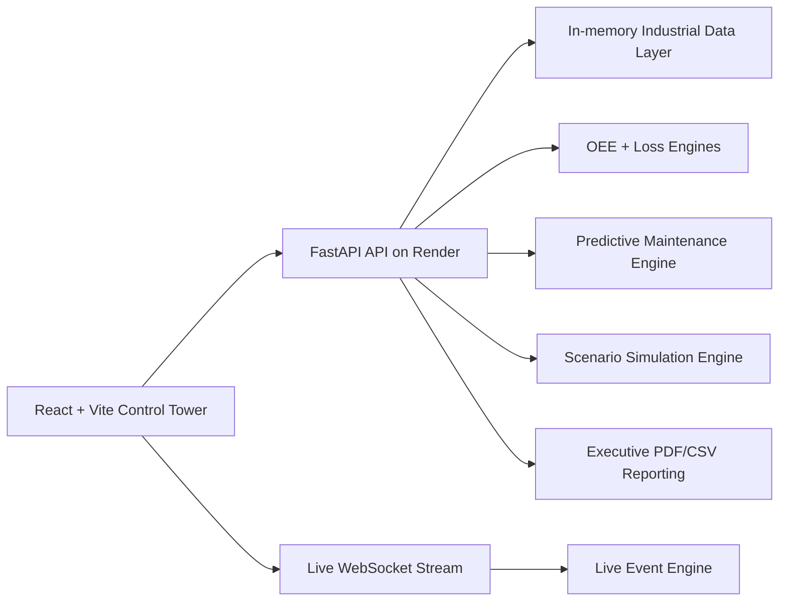

# Operations Intelligence Engine

AI-powered Operations Control Tower for industrial decision intelligence, live OEE monitoring, predictive maintenance, scenario simulation, and executive reporting.

The project is built as a production-style full-stack demo for plant leadership, manufacturing engineering, and operations teams. It keeps the stack simple enough to deploy quickly while modeling the kind of control tower experience used in modern factory AI platforms.

## Architecture



## Features

- Live OEE dashboard with realistic per-request variation
- Multi-plant, production line, and machine filtering
- Scenario toggle for normal operations, breakdown spike, and quality issue conditions
- AI summary and structured executive decision endpoint
- Predictive maintenance risk scoring with severity, remaining useful life, and recommended action
- Simulation studio for downtime, speed, quality, maintenance, and shift scenarios
- Live operations feed with rotating anomaly events and machine health indicators
- CSV upload for custom operational data
- Executive report export in PDF and CSV
- Graceful frontend fallbacks that keep previous data during API failures
- Dark enterprise React UI using Recharts and modular hooks/services

## Screenshots

Add screenshots here after deployment:

- Executive Summary
- Decision Center
- Predictive Risk Panel
- Simulation Studio
- Live Operations Feed
- Machine Health Matrix

## Backend API

Existing endpoints remain available:

- `GET /data`
- `GET /oee`
- `GET /loss`
- `GET /financial`
- `GET /anomaly`
- `GET /ai-summary`
- `GET /ai-decision`
- `POST /upload-data`
- `GET /machine-summary`
- `GET /export-report`
- `WebSocket /ws`

Platform endpoints:

- `GET /predictive-maintenance`
- `POST /simulate`
- `GET /events/recent`

Common filters:

- `plant_id`
- `line_id`
- `machine_id`
- `start_date`
- `end_date`
- `scenario`

Simulation example:

```json
{
  "machine": "M3",
  "action": "reduce downtime",
  "improvement_percent": 20
}
```

## Predictive Maintenance Logic

The predictive engine estimates machine failure risk from realistic industrial signals:

- downtime ratio
- speed loss ratio
- defect ratio
- historical anomaly count

It returns a risk score, severity band, remaining useful life estimate, and action recommendation for each machine in scope.

## Business Impact

The platform connects operational signals to financial impact:

- OEE trend shows production effectiveness
- loss analysis ranks downtime, performance, and quality losses
- AI decisioning turns loss drivers into prioritized actions
- simulation estimates OEE gain and revenue saved before execution
- executive reports package the operating story for leadership review

## Local Development

Backend:

```bash
cd backend
python -m pip install -r requirements.txt
uvicorn main:app --reload --host 0.0.0.0 --port 8000
```

Frontend:

```bash
cd frontend
npm install
npm run dev
```

Frontend environment:

```bash
VITE_API_URL=http://localhost:8000
VITE_WS_URL=ws://localhost:8000/ws
```

## Validation

Backend:

```bash
cd backend
python -m pytest
```

Frontend:

```bash
cd frontend
npm test
npm run build
```

## Render Backend Settings

- Service type: Web Service
- Root directory: `backend`
- Build command: `pip install -r requirements.txt`
- Start command: `uvicorn main:app --host 0.0.0.0 --port 10000`
- Python version: `3.12.13`

The included `render.yaml` preserves the backend deployment path.

## Vercel Frontend Settings

- Root directory: `frontend`
- Build command: `npm run build`
- Output directory: `dist`
- Environment variable: `VITE_API_URL=<Render backend URL>`
- Optional environment variable: `VITE_WS_URL=<Render backend websocket URL>/ws`

## Scalability Notes

This version intentionally keeps state in memory to preserve the current working architecture and keep deployment simple. The backend is now organized around engines and service boundaries so the next production step can add durable storage, authentication, queue-backed ingestion, and model registry integration without rewriting the frontend experience.

## Resume-Ready Summary

Built a full-stack industrial AI control tower using FastAPI, React, Vite, and Recharts. Added live simulated plant data, multi-plant filtering, predictive maintenance scoring, scenario simulation, executive AI decisioning, WebSocket event streams, CSV upload, PDF/CSV reporting, and production deployment documentation for Render and Vercel.
